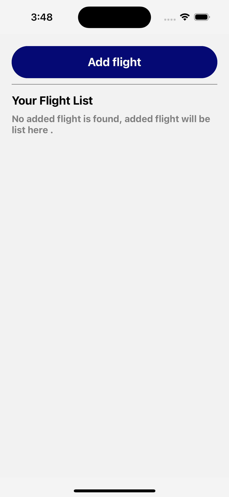
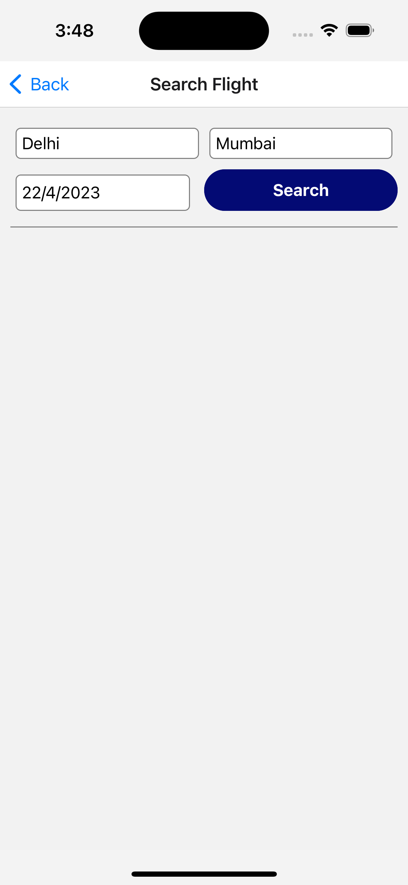
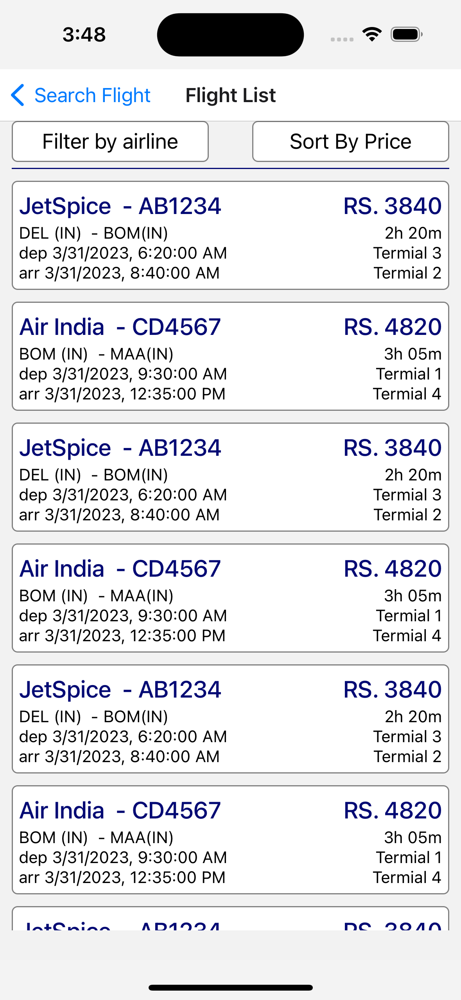
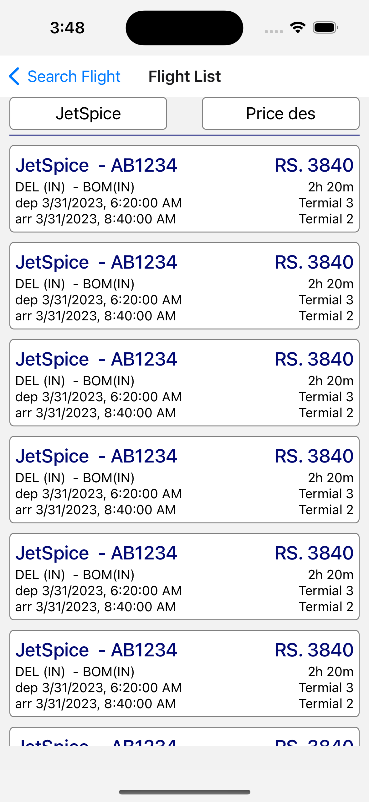
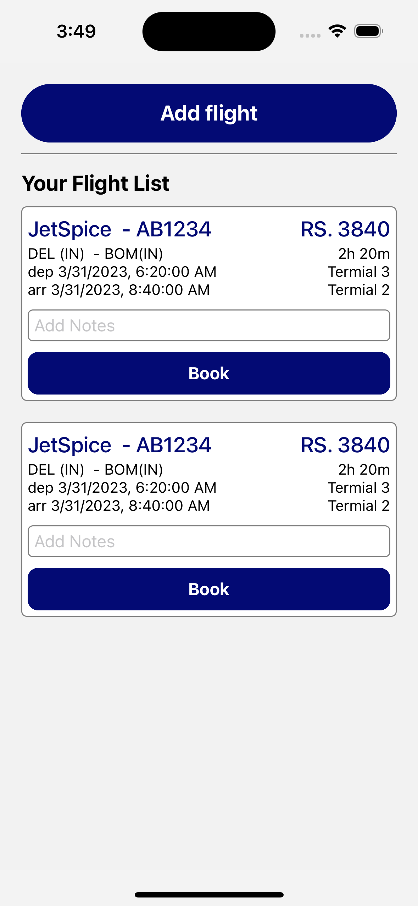
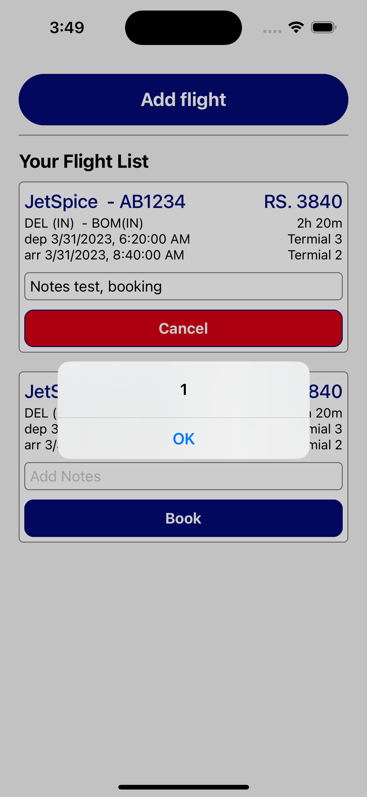
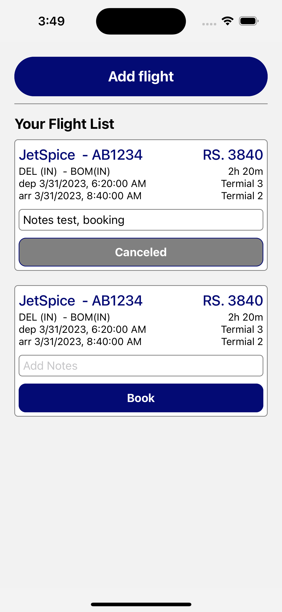

# ReactNativeTravelApp
Assignment app

Code - https://github.com/SunilKuYadav/ReactNativeTravelApp/tree/master

## About
This is a demo app build in React Native for booking flight.

## Library used
1. React Native
2. @react-navigation
3. @reduxjs/toolkit, react-redux, redux-logger
4. axios
5. react-native-date-picker
6. react-native-select-dropdown
7. typescript

## Screenshots

